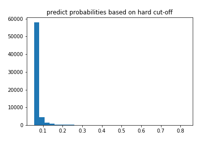

### 拒绝推断的代码和部分结果
1. roc曲线图像在roc_image文件中，其中ROC curve based on the accepted.png是四种图像画在一张图上的结果。
2. 接受样本上，每个模型的准确率，第一类第二类错误率等性能结果在result_log.txt文件中。
3. 并入拒绝样本后，训练得到的各项指标结果在reject_log.txt文件中。
4. reject_probas.png 是stacking模型对拒绝样本预测概率的直方图。可以看出其预测结果分布在0.1左右，所以使用0.5作为阈值，几乎所有样本都被划分到标签0了。

### 待解决的问题
1. 第一类第二类错误率怎麽计算？
	- 解决方案：参见其他的论文。
2. 由预测分布图可以看到，预测样本的概率都集中在0.1附近，使用0.5作为阈值。会让大部分的样本判断为0,即不违约，会导致犯以真为假的错误(第一类错误)。怎麽解决？
3. 硬截断法预测拒绝样本后，加入接受样本一起训练。导致结果更差了，AUC变小。怎麽处理改进后效果更差？
4. 现在论文中的验证集是接受样本的20%提取出来的，而实验中的验证集更科学是3000个样本+1300个接受样本。是否更改？
